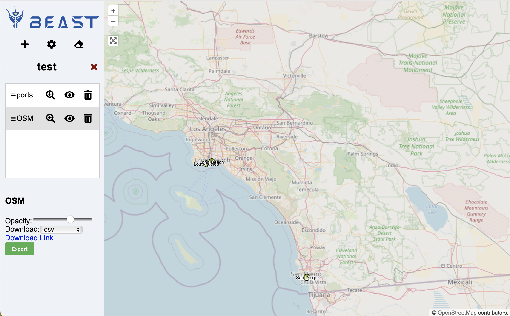
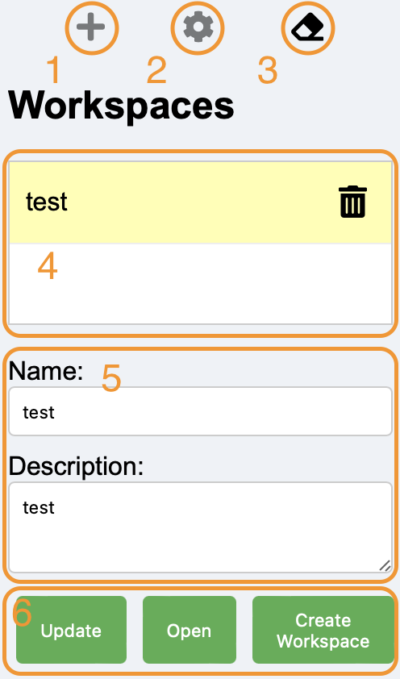
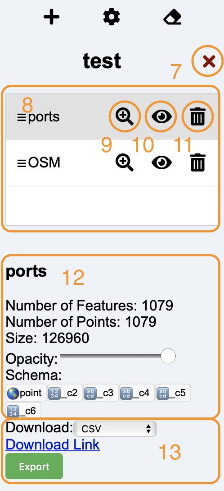
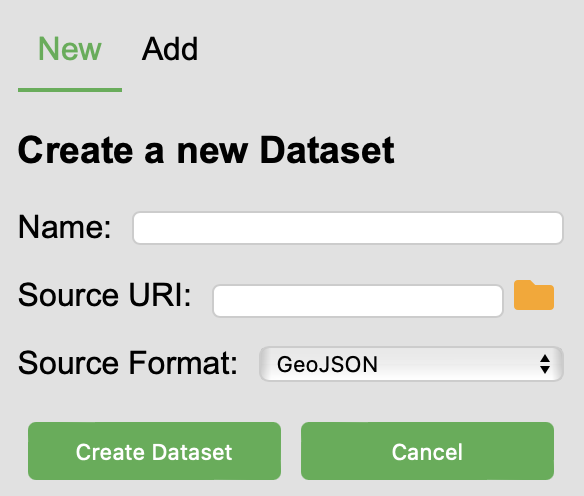
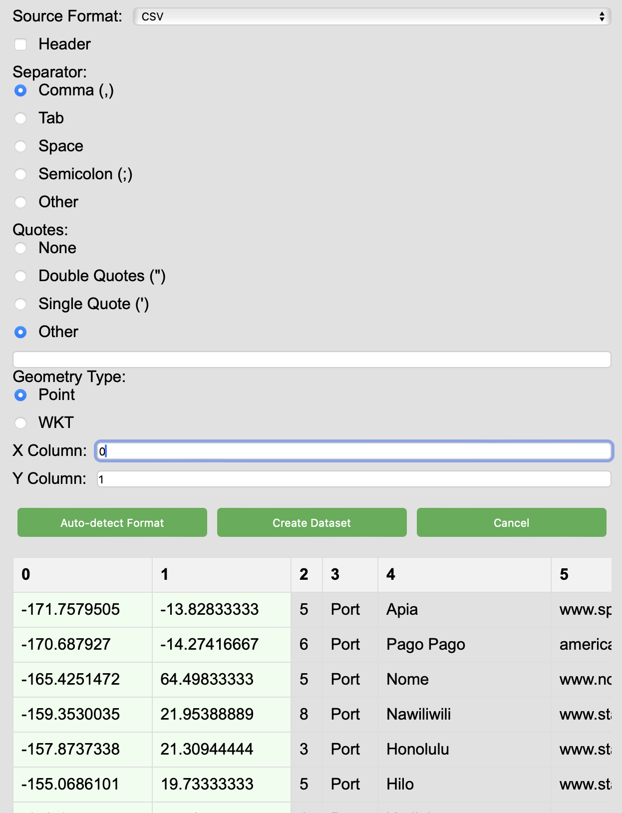
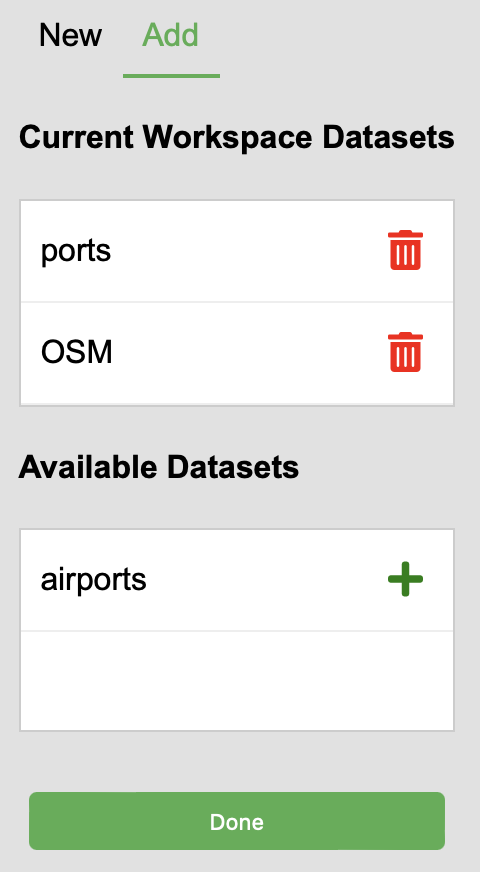
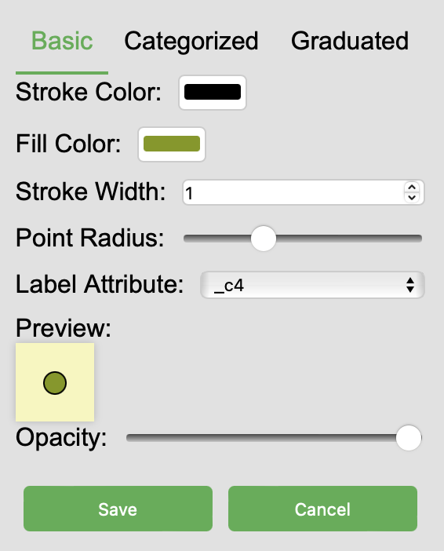
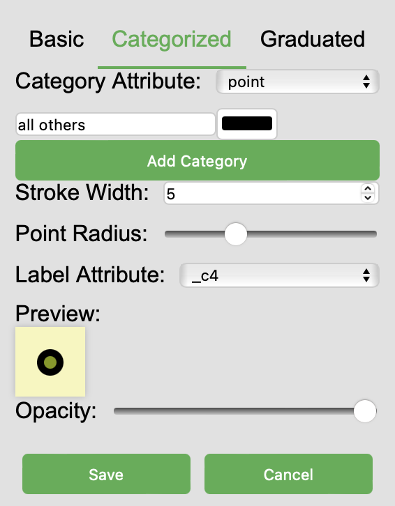
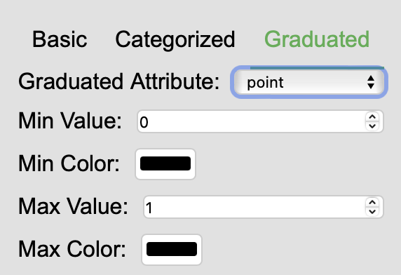

# Data Explorer

The Beast Web Interface provides an intuitive web-based platform to visualize and interact with spatial datasets.
Leveraging a RESTful API, it allows users to manage spatial datasets and workspaces efficiently,
offering a comprehensive set of operations for dataset manipulation and visualization on an interactive map.

## Features

- **RESTful API for Spatial Datasets and Workspaces Management:** Perform CRUD operations on datasets and workspaces through a REST API.
- **Interactive Map Visualization:** Explore spatial datasets on an interactive map with support for tiled visualization, zooming, and panning.
- **Customizable Dataset Styling:** Customize the visualization style of datasets within workspaces, including stroke color, width, fill color, and more.
- **Workspace and Dataset Management:** Create, update, and delete workspaces and datasets. Organize datasets within workspaces for better management.
- **Dynamic Dataset Processing:** Process datasets to generate tiled visualizations and manage their inclusion in workspaces dynamically.

## API Endpoints

### Dataset Operations
- `GET /datasets.json`: List all datasets in a JSON format.
- `POST /datasets.json`: Create a new dataset with provided parameters. Initially, the dataset is not in any workspace.
- `GET /datasets/(name).json`: Retrieve information for a specific dataset.
- `GET /datasets/(name)/download.(format)`: Download the specified dataset (or part of it) in the given format.
- `GET /datasets/(name)/process`: Processes the specified dataset from where it stopped.
- `DELETE /datasets/(name)`: Delete a specific dataset completely and remove all its files from all workspaces.
- `GET /datasets/(name)/tiles.json`: Retrieve information about tiled visualization for a dataset within a workspace.
- `GET /datasets/(name)/tiles/tile-z-x-y.(format)`: Retrieve a specific tile in a given format for a dataset within a workspace.
- `GET /datasets/dangling.json`: List all datasets that are not included in any workspaces.

### Workspace Operations
- `GET /workspaces.json`: List all available workspaces in a JSON format.
- `POST /workspaces.json`: Create a new workspace with the provided parameters.
- `GET /workspaces/(id).json`: Retrieve information about the given workspace.
- `PUT /workspaces/(id).json`: Update information about the given workspace.
- `DELETE /workspaces/(id)`: Delete the given workspace, removing associated datasets from it.
- `GET /workspaces/(id)/datasets.json`: List all datasets in the specified workspace.
- `GET /workspaces/(id)/datasets/(name)/style.json`: Retrieves the visualization style for a dataset within a workspace.
- `PUT /workspaces/(id)/datasets/(name)/style.json`: Updates the visualization style for a dataset within a workspace.
- `POST /workspaces/(id)/datasets/(name)`: Adds a dataset to a workspace.
- `DELETE /workspaces/(id)/datasets/(name)`: Removes a dataset from a workspace.

## Web Interface

The web interface is built using React and provides components for dataset and workspace management, including:

- `DatasetList`: Display and manage a list of datasets with support for drag-and-drop reordering.
- `MapViewer`: An OpenLayers map viewer for visualizing spatial data with custom controls.
- `StyleModal`: A modal for customizing dataset styles within a workspace, including attributes like color, width, and opacity.

## Getting Started

To get started with the Beast Web Interface:

1. Compile the project into a JAR file by running `mvn package`.
2. Run the server using the command `beast server -enableStaticFileHandling`.
3. Wait until the server starts. By default, it starts on port 8890.
4. Open your browser on the following URL to get started. [http://localhost:8890/dataExplorer/index.html]

*Note:* When you start the server with "-enableStaticFileHandling", it exposes your local file system and HDFS through
the web interface. Use this with caution and only when the server is only accessible to authorized users.

## Main Features
### Workspace Manager

1. Add a new dataset. Only enabled when a workspace is selected.
2. Create a dataset by running a query. Only enabled when a workspace is selected.
3. Cleanup. Opens a dialog that allows you to delete unused datasets.
4. The list of available workspaces.
5. The details of the currently selected workspace. Changes are only saved when "Update" button (6) is clicked.
6. Action buttons. *Update* the currently selected workspace,
   *Open* The currently selected workspace,
   or *Create* a new workspace.

### Dataset Manager

7. Close the current workspace and return to the list of workspaces.
8. The list of available datasets. The order of these datasets specifies the layer ordering in the main map.
   So, it is recommended to always keep the OSM layer at the bottom.
   Datasets can be reordered using drag and drop.
9. Zoom to extents. Change the map view to contain this dataset.
10. Toggle visibility of this dataset.
11. Remove this dataset from the workspace. Notice that this doesn't immediately delete the dataset from the server.
12. The details of the selected dataset. The *Opacity* slider can be dragged to adjust the opacity of the current dataset.
13. A link to download the dataset back. Choosing the format updates the download link to download the entire dataset.
   The "Export" button open the export dialog to save the dataset directly to the local disk or HDFS.

### Create a New Dataset

When you click the add dataset button (1), the following dialog opens.

Each dataset should be given a unique identifier. This identifier will be used later in SQL queries
so it should not include special characters that are not supported by SQL.

The URI can either be a web URL, a local file, or a file in HDFS (if configured).
You should always use an absolute path. If you want to browse the file system, you can click the folder icon.

The source format allows you to choose the correct file format of the input file.
Once you enter a URI, the interface will try to guess the format based on the file extension.
Below are the available file formats.

#### GeoJSON
A GeoJSON format that includes a list of features. This can be either a proper GeoJSON file that contains
with a feature collection or a JSON Line format where each line has a separate feature. Both will work fine
and you don't need to choose which of these you have.

#### Shapefile &copy;
The Esri Shapefile format. This can be either a directory that has multiple Shapefiles or a single Shapefile.
The Shapefile can also be compressed in ZIP format and they will be parsed correctly.

#### CSV
The CSV (or generally delimited text format) is a text format where each record is stored in a separate line.
The separator can be comma or tab (most common) or can be any other character.
The first line can have a header line that contains attribute name.
The geometries in CSV files can be either points where `x` and `y` are stored in two columns,
or other geometries stored in WKT format.

When you choose the CSV format, additional options will open.
You can let the application guess the parameters of the CSV file by clicking the "Auto-detect Format" button at the bottom.
If it is not correct, you can further tweak it by selecting the right parameters.

- *Header*: Check this box if the first line of the file contains attribute names.
- *Separator*: The character that separates fields in one line. You can either choose one of the standard separators or provide your own.
- *Quotes*: If some fields are quoted, you can choose the quote character. You can also choose "None" if the fields are not quoted.
- *Geometry Type*: This can be either "Point" for (x, y) attributes, or "WKT" for wkt-encoded attribute.
- *X, Y Columns*: If you choose "Point" as the geometry type, then you need to specify the names or the indices of the two columns. The indices start at zero.
- *WKT Column*: If you choose "WKT" as the geometry type, then you need to specify the name or the index of the WKT attribute. Indices start at zero.

If you click "Auto-detect Format" once, a preview of the file will be loaded.
As you choose the parsing options, the file will be adjusted to reflect your choice.
This can help you make the right selection.
The selected geometry attribute, X, Y, or WKT, will be highlighted.

#### GPX
GPX is an XML-based file format for GPS tracks.

#### JSON+WKT
A regular JSON file where each record is stored in a separate line.
One of the attributes contains a WKT-encoded geometry. You need to specify the

#### GeoParquet
A regular Parquet file where one attribute contains a WKB-encoded geometry.
You need to specify the attribute that contains the WKB geometry.

#### SpatialParquet
A regular Parquet file where one group contains a geometry encoded in a structured format.
You need to specify the group that contains the geometry.

### Add an Existing Dataset
Other than creating a new dataset, you can also add an existing dataset to the current workspace
or remove datasets from the current workspace.

## Styling
When you double-click a dataset, you can specify the rendering style of this dataset.
Choose the desired style and click "Save" to apply the style or "Cancel" to revert all changes.

### Basic Styling

Basic styling applies the same style to all features.
You can specify a color for the stroke and the fill.
You can also specify the stroke width in pixels.
For point dataset that are rendered as circles, you can specify the point radius in pixels.
If you want to add a label to each attribute, you can choose an attribute from the "Label Attribute" dropdown menu.
The preview will show you the colors, stroke width, radius, and opacity.
The opacity applies to the entire layer including store, fill, and label.

### Categorized Styling

Categorized styling allows you to choose a different fill color for each record based on a specific attribute.
This will inherit the stroke color from the "Basic" tab.
At the top, choose the "Category Attribute" which is the attribute you want to use to choose the fill color.
For each category, click the "Add Category" button to specify the value and color for that value.

### Graduated Styling

The graduated styling allows you to change the fill color gradually between two values of a specific attribute.
This should only be used on numeric attributes that represent a continuous value.

At the top, choose the numeric attribute you would like to use for the fill color.
Choose the minimum and maximum values and the corresponding two colors.
The application will use RGB interpolation between these two colors. That is, each of the three components will be
separately and linearly interpolated between the two specified values.

## Cleanup Datasets
If you have datasets that are no longer used in any workspaces, click the "Cleanup" button (3).
This will open a new dialog that lists all datasets that are not used in any workspaces.
Click the delete button next to any of these datasets to permanently delete it.