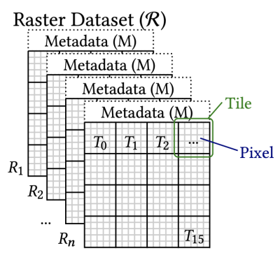
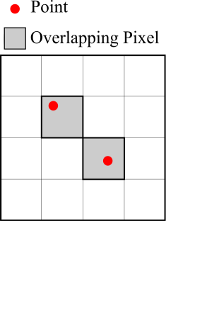
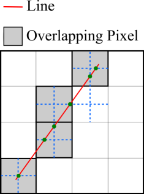
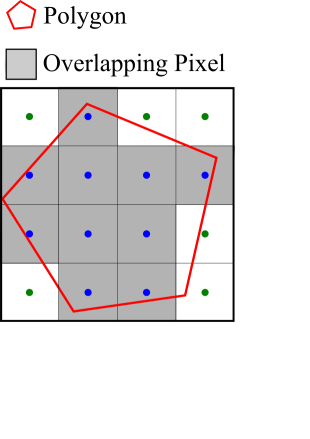

# Raptor Join
Satellite data is an excellent and rich source of data that can further enrich your data exploration.
However, since satellite dats is represented as raster data, i.e., images, it becomes challenging
to combine it with vector data, i.e., points, lines, and polygons.
Beast makes it fairly easy to combine raster and vector data through a specialized component called
Raptor (short for Raster-Plus-Vector). The core transformation, Raptor Join, takes as input two RDD, raster and vector,
and produce an RDD with matching geometries and pixels.
The example below illustrates how to run this operation to find pixels that are inside each state.

**Note**: For simplicity, the tutorial uses Scala for the code snippets.
If you would like to use Java, you will find a complete example at the end of this page.

```scala
val raster: RDD[ITile] = sc.geoTiff("treecover")
val vector: RDD[IFeature] = sc.shapefile("us_states")
val join: RDD[(IFeature, Int, Int, Float)] = raster.raptorJoin[Float](vector)
```

The resulting RDD can be further used with other operations such as filtering and aggregation.

## Raster+Vector Join
To understand how Raptor join works, you need first to understand the Raptor predicates, i.e., how geometries and pixels are combined. The following part explains the three predicates that Beast supports based on the polygon type, i.e., point, line, or polygon.

### Raster data representation



A raster file is organized as a two-dimensional matrix of pixels. Each raster file is associated with metadata that records how the data is organized and how each pixel is mapped to a geographical region on earth.

### Point Join


When joining a point dataset with raster data, each point is matched with the pixel that contains this point.

### Line Predicate


A line matches with pixels that are closest to the line. As shown in the figure, the closest pixels are the ones that have a crosshair that intersect the line.

### Polygon Predicate


A polygon matches with pixels that have a center inside the polygon boundary.

## Example: Tree cover for US States
In this example, we will use the [Tree Cover](https://lpdaac.usgs.gov/products/gfcc30tcv003/) dataset available by USGS to estimate the amount of trees per US state. We will use the 2015 version available at [this link](https://e4ftl01.cr.usgs.gov/MEASURES/GFCC30TC.003/2015.01.01/).

### Prerequisite 1: Download the raster data
To download the data easily, [create an account](https://urs.earthdata.nasa.gov/users/new) to access the data, [setup command-line access](https://lpdaac.usgs.gov/resources/e-learning/how-access-lp-daac-data-command-line/) through `.netrc` file, and then run [this script](binaries/download-treecover.sh) to download the data. This script will download the ZIP files, extract them, compress the GeoTIFF file to reduce disk space, and cleanup any non-used files. Notice, it will take a long time to download the data based on your internet speed. Feel free to reduce the list of files in the downloaded script to download fewer files for testing. We will place all the downloaded files in a directory called `treecover`.

### Prerequisite 2: Download the vector data
We will use the [countries dataset](https://star.cs.ucr.edu/?NE/countries#center=20.3,-65.3&zoom=3) from [Natural Earth](https://www.naturalearthdata.com/). No registration is needed to access the data and you can download from at [this link](https://www.naturalearthdata.com/http//www.naturalearthdata.com/download/10m/cultural/ne_10m_admin_0_countries.zip).

### 1- Load raster and vector data
```scala
val treecover: RDD[ITile[Float]] = sc.geoTiff("treecover")
val countries: RDD[IFeature] = sc.shapefile("ne_10m_admin_0_countries.zip")
```

### 2- Run the Raptor join operation
Use the Raptor join operation to combine the raster and vector data. Since the vector data contains polygons, Beast will associate each polygon with the pixels inside the polygon.
```scala
val join: RDD[RaptorJoinFeature[Float]] = treecover.raptorJoin(countries)
  .filter(v => v.m >= 0 && v.m <= 100.0)
```
The filter operation keeps only the valid values that represent tree cover. Values outside this range represent other features such as clouds or water.

### 3- Aggregate the result
To complete the zonal statistics operation, this step aggregates the data by state to compute the total amount of trees in each state.
```scala
val countries_treecover: RDD[(String, Float)] = join.map(v => (v._1, v._5))
  .reduceByKey(_+_)
  .map(fv => {
    val name: String = fv._1.getAs[String]("NAME")
    val treeCover: Float = fv._2
    (name, treeCover)
  })
```

### 4- Write the output
The final step will write the output to screen. You can also choose to write the output to a file using the method `saveAsTextFile` if it is too big.
```scala
println("State\tTreeCover")
for (result <- countries_treecover.collectAsMap())
  println(s"${result._1}\t${result._2}")
```

## Complete code example

The entire code is shown below.
```scala
/*
 * Copyright 2023 University of California, Riverside
 *
 * Licensed under the Apache License, Version 2.0 (the "License");
 * you may not use this file except in compliance with the License.
 * You may obtain a copy of the License at
 *
 *     http://www.apache.org/licenses/LICENSE-2.0
 *
 * Unless required by applicable law or agreed to in writing, software
 * distributed under the License is distributed on an "AS IS" BASIS,
 * WITHOUT WARRANTIES OR CONDITIONS OF ANY KIND, either express or implied.
 * See the License for the specific language governing permissions and
 * limitations under the License.
 */
package edu.ucr.cs.bdlab.beastExamples

import edu.ucr.cs.bdlab.beast._
import edu.ucr.cs.bdlab.beast.geolite.{IFeature, ITile}
import org.apache.spark.SparkConf
import org.apache.spark.rdd.RDD
import org.apache.spark.sql.SparkSession

/**
 * Scala examples for Beast
 */
object RaptorExample {
  def main(args: Array[String]): Unit = {
    val conf = new SparkConf().setAppName("Raptor Example")
    // Set Spark master to local if not already set
    if (!conf.contains("spark.master"))
      conf.setMaster("local[*]")

    val spark: SparkSession = SparkSession.builder().config(conf).getOrCreate()
    val sc = spark.sparkContext
    try {
      // 1- Load raster and vector data
      val treecover: RDD[ITile[Float]] = sc.geoTiff("treecover")
      val countries: RDD[IFeature] = sc.shapefile("ne_10m_admin_0_countries.zip")

      // 2- Run the Raptor join operation
      val join: RDD[RaptorJoinFeature[Float]] = treecover.raptorJoin(countries)
        .filter(v => v.m >= 0 && v.m <= 100.0)
      // 3- Aggregate the result
      val countries_treecover: RDD[(String, Float)] = join.map(v => (v.feature, v.m))
        .reduceByKey(_ + _)
        .map(fv => {
          val name: String = fv._1.getAs[String]("NAME")
          val treeCover: Float = fv._2
          (name, treeCover)
        })
      // 4- Write the output
      println("State\tTreeCover")
      for (result <- countries_treecover.collectAsMap())
        println(s"${result._1}\t${result._2}")
    } finally {
      spark.stop()
    }
  }
}
```

Java example
```java
/*
 * Copyright 2023 University of California, Riverside
 *
 * Licensed under the Apache License, Version 2.0 (the "License");
 * you may not use this file except in compliance with the License.
 * You may obtain a copy of the License at
 *
 *     http://www.apache.org/licenses/LICENSE-2.0
 *
 * Unless required by applicable law or agreed to in writing, software
 * distributed under the License is distributed on an "AS IS" BASIS,
 * WITHOUT WARRANTIES OR CONDITIONS OF ANY KIND, either express or implied.
 * See the License for the specific language governing permissions and
 * limitations under the License.
 */
import edu.ucr.cs.bdlab.beast.JavaSpatialRDDHelper;
import edu.ucr.cs.bdlab.beast.JavaSpatialSparkContext;
import edu.ucr.cs.bdlab.beast.common.BeastOptions;
import edu.ucr.cs.bdlab.beast.geolite.IFeature;
import edu.ucr.cs.bdlab.beast.geolite.ITile;
import org.apache.spark.SparkConf;
import org.apache.spark.api.java.JavaPairRDD;
import org.apache.spark.api.java.JavaRDD;
import org.apache.spark.sql.SparkSession;
import scala.Tuple2;
import scala.Tuple5;

import java.util.Map;

public class BeastJava {
  public static void main(String[] args) {
    // Initialize Spark
    SparkConf conf = new SparkConf().setAppName("Beast Example");

    // Set Spark master to local if not already set
    if (!conf.contains("spark.master"))
      conf.setMaster("local[*]");

    // Create Spark session (for Dataframe API) and Spark context (for RDD API)
    SparkSession sparkSession = SparkSession.builder().config(conf).getOrCreate();
    JavaSpatialSparkContext sparkContext = new JavaSpatialSparkContext(sparkSession.sparkContext());

    try {
      // 1- Load raster and vector data
      JavaRDD<ITile<Float>> treecover = sparkContext.geoTiff("treecover");
      JavaRDD<IFeature> countries = sparkContext.shapefile("ne_10m_admin_0_countries.zip");

      // 2- Run the Raptor join operation
      JavaRDD<RaptorJoinFeature<Float>> join =
          JavaSpatialRDDHelper.raptorJoin(countries, treecover, new BeastOptions())
              .filter(v -> v.m() >= 0 && v.m() <= 100.0);
      // 3- Aggregate the result
      JavaPairRDD<String, Float> countries_treecover = join.mapToPair(v -> new Tuple2<>(v.feature(), v.m()))
          .reduceByKey(Float::sum)
          .mapToPair(fv -> {
            String name = fv._1.getAs("NAME");
            float treeCover = fv._2;
            return new Tuple2<>(name, treeCover);
          });
      // 4- Write the output
      System.out.println("State\tTreeCover");
      for (Map.Entry<String, Float> result : countries_treecover.collectAsMap().entrySet())
        System.out.printf("%s\t%r\n", result.getKey(), result.getValue());
    } finally {
      // Clean up Spark session
      sparkSession.stop();
    }
  }
}
```