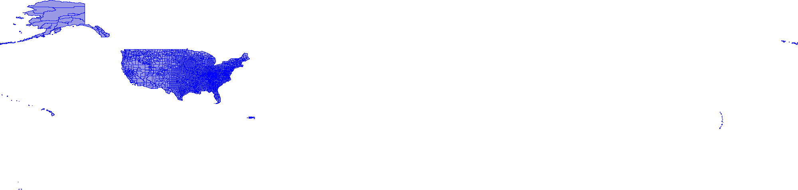
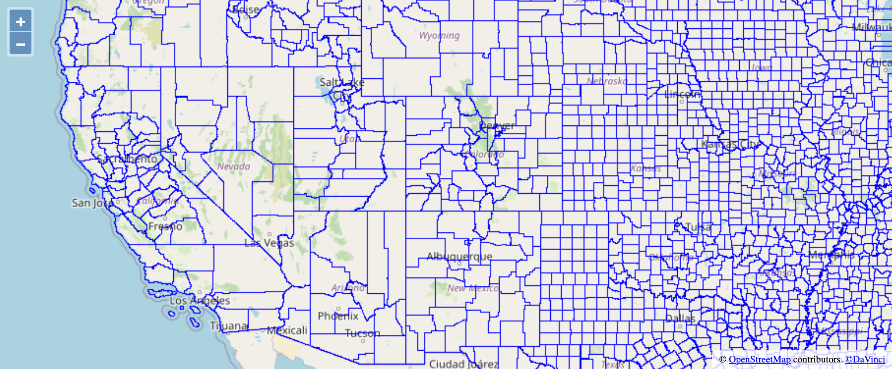

# Visualization
This article describes the visualization functions available in Beast for big spatial data.
Beast provides two ways of visualization, *single image* and *multilevel visualization*.
*Single level* produces one image with a specific resolution while 
*multilevel visualization* produces an HTML page based on [OpenLayers](https://openlayers.org/) which can be explored interactively.

## Prerequisites
- If you use the command-line interface (CLI), [setup the Beast command](beast-cmd).
- If you use the Scala API, [setup a project for Scala](dev-setup) or [setup the Beast shell](beast-shell).
- If you use the Java API, [setup a project for Java](dev-setup).

## Single-image Visualization



### Command-line interface
To produce a single image visualization from the command line, use the `splot` command like the example below.

```shell
beast splot tl_2018_us_county.zip iformat:shapefile counties.png plotter:gplot width:2000 height:2000 stroke:blue fill:#9999e6
```
You can download the [US counties dataset](https://star.cs.ucr.edu/?TIGER2018/COUNTY#center=38.41,-112.20&zoom=6) at [this link](ftp://ftp2.census.gov/geo/tiger/TIGER2018/COUNTY/tl_2018_us_county.zip)

### Scala API
The following Scala code can generate the same image above.
```scala
sparkContext.shapefile("tl_2018_us_county.zip")
    .plotImage(2000, 2000, "counties.png", opts = Seq("stroke" -> "blue", "fill" -> "#9999e6"))
```

### Java API
From Java, you can use the following code for visualization.
```java
JavaRDD<IFeature> counties = SpatialReader.readInput(sparkContext, new BeastOptions(), "tl_2018_us_county.zip", "shapefile");
JavaSpatialRDDHelper.plotImage(counties, 2000, 2000, "counties.png",
          new BeastOptions().set("stroke", "blue").set("fill", "#9999e6"));
```
## Multilevel Visualization
There are two ways to produce a multilevel image in Beast, the *efficient* way and the *portable* way. The efficient way can scale to very large data and an arbitrary number of zoom levels but it requires hosting a server (included in Beast) to see the visualization. The *portable* way is recommended for a small number of zoom levels, e.g., up-to 10 levels, but it produces a visualization that does not require a server to visualize, hence, can be easily hosted on any static website. The difference between them is minimal but we include both of them below for clarity.



### Command-line Interface (CLI) (Efficient version)
To generate an interactive visualization similar to the one above, use the `mplot` command as shown below.

```shell
# Build an index on the data first (Recommended)
beast index tl_2018_us_county.zip iformat:shapefile oformat:rtree counties_index 
# Plot the indexed data
beast mplot counties_index iformat:rtree counties_visualization.zip -mercator plotter:gplot levels:20 stroke:blue
# Start the server
beast server
```

Once the three commands above finish and the server is started, you will see the following lines in the output.
```text
21/01/03 18:08:55 INFO log: Started SocketConnector@0.0.0.0:8890
21/01/03 18:08:55 INFO BeastServer: Started the server on port 8890
```
Now, open your browser and navigate to [http://localhost:8890/dynamic/visualize.cgi/counties_visualization.zip/].

*Note*: The trailing slash in the link is important to see the visualization correctly.

### Command-line Interface (CLI) (Portable version)
To generate an interactive visualization that does not require a server, use the same `mplot` command but set `threshold:0` parameter as shown below.
```shell
beast mplot counties_index iformat:rtree counties_visualization_portable.zip -mercator plotter:gplot levels:10 stroke:blue threshold:0
```
Notice that we reduce the number of levels to 10 since the portable version is not as scalable as the efficient version.
You will notice that it will take much longer for the `mplot` command to finish since it will generate every non-empty tile in 10 zoom levels.
Once the execution completes, navigate to the created file `counties_visualization_portable.zip`, extract it, and double-click the `index.html` file.
You will see the same exact visualization, but you will be limited to 10 zoom levels.

### Scala API (Efficient version)
To generate a scalable multilevel index from Scala, you can use the following code snippet as a reference. It has three parts, first index the raw dataset, second build the multilevel visualization, third start the server.

```scala
// Index the datasets
sparkContext.shapefile("tl_2018_us_county.zip")
  .spatialPartition(classOf[RSGrovePartitioner])
  .writeSpatialFile("counties_index", "rtree")
// Build the multilevel visualization
sparkContext.spatialFile("counties_index")
  .plotPyramid("counties_multilevel.zip", 20,
    opts = Seq("mercator" -> true, "stroke" -> "blue", "threshold" -> "1m"))
// Start the server
new BeastServer().run(new BeastOptions(), null, null, sparkContext)
```

### Scala API (Portable version)
With the portable version, the only change you need to do is to set the `threshold` parameter to zero similar to the following example.
```scala
sparkContext.shapefile("tl_2018_us_county.zip")
  .plotPyramid("counties_multilevel_portable.zip", 10,
    opts = Seq("mercator" -> true, "stroke" -> "blue", "threshold" -> 0))
```

### Java API (Portable version)
Similar to all other examples, you can control whether to use the scalable or portable method using the `threshold` parameter. Below is an example of the portable version.

```java
JavaRDD<IFeature> counties = SpatialReader.readInput(sparkContext, new BeastOptions(), "tl_2018_us_county.zip", "shapefile");
MultilevelPlot.plotFeatures(counties, 0, 9, GeometricPlotter.class, 
          null, "counties_multilevel_portable.zip", 
          new BeastOptions().set("stroke", "blue").set("fill", "#9999E6").setLong("threshold", 0));
```