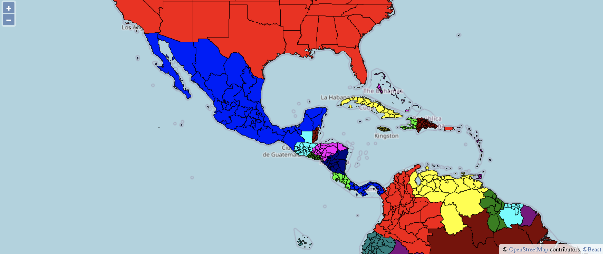
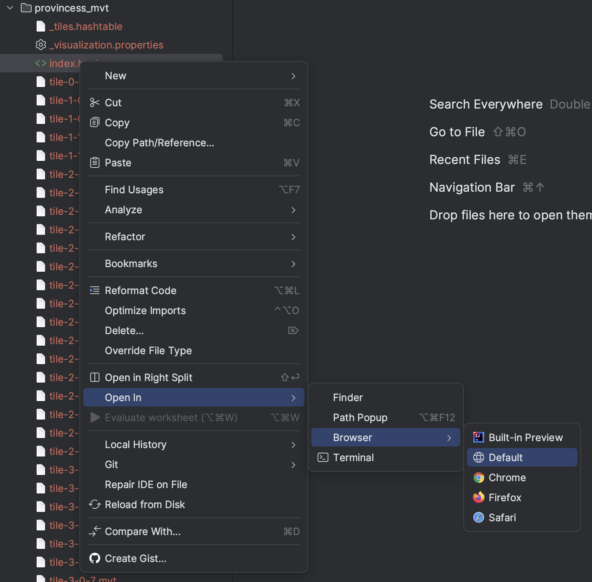

# Visualization
This article describes how to visualize big datasets using vector tiles in the MVT format.
This function produces a pyramid of tiles that are ready to be visualized in [OpenLayers](https://openlayers.org/).
Vector tiles are rendered in the browser which makes them more flexible in styling.
By just modifying the accompanying HTML file, you can change colors, line styles, fill styles, and more.
Also, since vector tiles contain more information about the features, the styling can be based on the data.
For example, you can use gradients of colors or icon styles based on specific attributes of the data.
Notice that this article focuses on the generation of the tiles and it is up-to the user on how to style them.



The example above is a visualization of the [provinces dataset](https://star.cs.ucr.edu/?NE/states_provinces#center=30.78,-82.56&zoom=3).
In this example, we used a styling function that colors the provinces in each country with a different color. 
This can be easily done with the following JavaScript code snippet.

```javascript
const mapColors = [
  '#FF0000', // Red
  '#00FF00', // Green
  '#0000FF', // Blue
  '#FFFF00', // Yellow
  '#FF00FF', // Magenta
  '#00FFFF', // Cyan
  '#800000', // Maroon
  '#008000', // Dark Green
  '#000080', // Navy
  '#808000', // Olive
  '#800080', // Purple
  '#008080', // Teal
  '#C0C0C0'  // Silver
];
return new ol.style.Style({
  stroke: new ol.style.Stroke({ color: 'rgba(0,0,0,0.8)', width: 1.0 }),
  fill: new ol.style.Fill({ color: mapColors[feature.getProperties()["mapcolor13"]-1] })
});
```

## Prerequisites
- If you use the command-line interface (CLI), [Setup Beast command](installation.md).
- If you use the Scala API, [Setup a project for Scala](dev-setup.md) or [Setup Beast shell](installation.md).
- If you use the Java API, [Setup a project for Java](dev-setup.md).

## Portable Version
The portable version generates and saves all non-empty tiles to disk.
This makes it easy to copy all the generated the files or host them as static files with no server-side processing.
This is accomplished by setting the threshold parameter to zero.

### Command-Line Interface

```shell
beast vmplot ne_10m_admin_1_states_provinces.zip iformat:shapefile provinces_mvt.zip threshold:0 levels:7 -overwrite
```

This will generate a ZIP file that contains all the generated tiles. To visualize this file, run the Beast server using
the following command:
```shell
beast server
```

And then open your browser and navigate to the page [http://localhost:8890/dynamic/visualize.cgi/provinces_mvt.zip/].

*NOTE*: The trailing slash in the URL is required.

If you don't want to start Beast server, you can first decompress the ZIP archive and then open the index.html
file from IntelliJ as show below.



#### Scala
You can generate the tiles from Scala using the following code.

```scala
val opts: BeastOptions = "threshold" -> 0
val features = sparkContext.shapefile("ne_10m_admin_1_states_provinces.zip")
val tiles = MVTDataVisualizer.plotAllTiles(features, levels=0 to 6, resolution=256, buffer=5, opts)
MVTDataVisualizer.saveTilesCompact(tiles, "provinces_mvt.zip", opts)
```
This code snippet visualizes all tiles in levels zero to six (inclusive) and sets the threshold to zero to 
generate all non-empty tiles. It sets the resolution of the tile to 256&times;256 and a buffer of five pixels.
The buffer is useful to hide the tile boundaries.
It saves all tiles to a compact ZIP file which is generally more efficient since file systems work better with
few large files instead of many small files. Alternatively, you can use the method `MVTDataVisualizer.saveTiles()`
which generates all the tiles and the HTML file to a directory without compression. Use this only for debugging
and when the number of generated tiles is small to avoid unnecessary disk overhead.

## Efficient Version
The portable version suffers from the exponential increase in the number of generated tiles.
This is impossible to avoid if all tiles need to be generated. The efficient version generates only the tiles that
cover a big portion of the dataset and leaves other tiles for on-the-fly generation.
This allows the efficient version to visualize an arbitrary number of levels, e.g., 20 zoom levels,
which allows the users to zoom in to street level and inspect individual records.

For the on-the-fly generation to work efficiently, it is recommended to build an accompanying R*-Grove index.
Also, the efficient version requires an active server to run to serve on-the-fly tiles. This method generally
runs in three steps, index, visualize, and serve.

### Command-line interface
The following three commands runs the three steps of visualization.
```shell
# Build an index on the data first (Recommended)
beast index ne_10m_admin_1_states_provinces.zip iformat:shapefile oformat:rtree provinces_index 
# Plot the indexed data
beast vmplot provinces_index iformat:rtree provinces_mvt.zip levels:20
# Start the server
beast server
```

Once the three commands above finish and the server is started, you will see the following lines in the output.
```text
21/01/03 18:08:55 INFO log: Started SocketConnector@0.0.0.0:8890
21/01/03 18:08:55 INFO BeastServer: Started the server on port 8890
```
Now, open your browser and navigate to [http://localhost:8890/dynamic/visualize.cgi/provinces_mvt.zip/].


### Scala

The three steps can also be accomplished using the following code snippet.
```scala
// Index the datasets
sparkContext.shapefile("ne_10m_admin_1_states_provinces.zip")
    .partitionBy(classOf[RSGrovePartitioner])
    .saveAsIndex("provinces_index", "rtree")
// Build the multilevel visualization
val tiles = MVTDataVisualizer.plotAllTiles(sparkContext.spatialFile("provinces_index"),
    levels=0 to 19, resolution=256, buffer=5, "threshold" -> "1m")
// Save the tiles
MVTDataVisualizer.saveTilesCompact(tiles, "provinces_mvt.zip", opts)
// Start the server
new BeastServer().run(new BeastOptions(), null, null, sparkContext)
```

Now, open your browser and navigate to [http://localhost:8890/dynamic/visualize.cgi/provinces_mvt.zip/].
