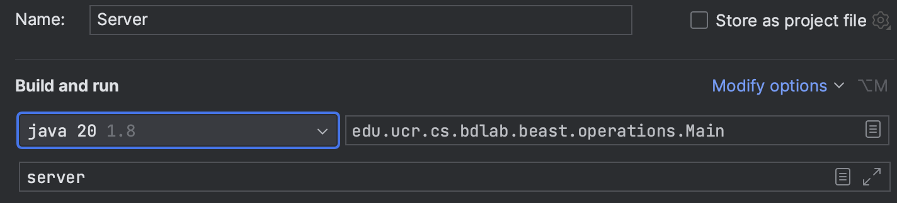

# Web Operations
This page describes how to create a new web operation that is integrated into the Beast server.
This is helpful when building client/server web applications where the server needs to access Beast features.
Beast ships with a Jetty server that provides some basic functionality and you can easily expand it with custom operations
as described below.
For example, the [DaVinciServer](../visualization/src/main/java/edu/ucr/cs/bdlab/davinci/DaVinciServer.java) class
handles web-based visualization similar to the one used in [UCR-Star](https://star.cs.ucr.edu)

## Prerequisites

- Setup your project to use Beast as shown in the [development setup guide](dev-setup.md).

## Steps
1. Create a new class that will hold your custom applications
```scala
import edu.ucr.cs.bdlab.beast.common.BeastOptions
import edu.ucr.cs.bdlab.beast.util.AbstractWebHandler
import org.apache.spark.SparkContext

class CustomServer extends AbstractWebHandler {

  var sc: SparkContext = _

  override def setup(sc: SparkContext, opts: BeastOptions): Unit = {
    super.setup(sc, opts)
    this.sc = sc
    // Additional initialization steps
  }
}
```
The setup function is optional and allows you to add additional initialization steps that run once when the server starts.

2. Add a simple web method that computes some summary information for a given dataset file.
```scala
@WebMethod(url = "/datasets/{datasetName}/summary.json")
def handleSummary(target: String, request: HttpServletRequest, response: HttpServletResponse, datasetName: String): Boolean = {
  val dataset = sc.geojsonFile(datasetName)
  val summary = dataset.summary
  // Write the result
  response.setStatus(HttpServletResponse.SC_OK)
  response.setContentType("application/json")
  val jsonGenerator = new JsonFactory().createGenerator(response.getOutputStream)
  jsonGenerator.writeStartObject()
  jsonGenerator.writeStringField("dataset", datasetName)
  jsonGenerator.writeArrayFieldStart("mbr")
  jsonGenerator.writeNumber(summary.getMinCoord(0))
  jsonGenerator.writeNumber(summary.getMinCoord(1))
  jsonGenerator.writeNumber(summary.getMaxCoord(0))
  jsonGenerator.writeNumber(summary.getMaxCoord(1))
  jsonGenerator.writeEndArray()
  jsonGenerator.writeNumberField("numFeatures", summary.numFeatures)
  jsonGenerator.writeEndObject()
  jsonGenerator.close()
  true
}
```
The method name is arbitrary but the method has to be annotated with `WebMethod`.
In the annotation, the URL defines the web URL at which the method can be accessed.
You can define a variable, e.g., `{datasetName}`, within the URL.
The variable will be matched with the corresponding parameter of the method in the same order of appearance.
It is preferred to use the same name for readability but Beast will match them by order not by name.
The method itself is similar to handling any Jetty method where the function receives a path, a request, and a response.
Beast will add any additional parameters that you specify in the URL, e.g., `datasetName`.
In this method, we simply load the file as a geoJSON file and summarize it.
To return a correct response, you need to set the status code and content type.
In this example, we used the response code `OK/200` and the content type of `application/json`.
The rest of the function writes the response in JSON format.
The final `true` return value indicates that the method was handled successfully.

3. Configure the class as a new web method. Create a file `beast.xml` under resources and use the following content.
```xml
<?xml version="1.0" encoding="UTF-8" ?>
<beast>
  <WebHandlers>
    <WebHandler>com.example.beastExample.CustomServer</WebHandler>
  </WebHandlers>
</beast>
```
4. To test the code, download a sample GeoJSON file and place in the project working directory.
For example, download the [`NE/ports` dataset from UCR-Star](https://star.cs.ucr.edu/?NE/ports&d#center=14.7,-60.3&zoom=3).

5. Run the server by running the class `edu.ucr.cs.bdlab.beast.operations.Main` with the parameter `server`.
   If you use IntelliJ IDEA, create a configuration similar to the following.



When the program starts, it will print something similar to the following.
```
0    [main] INFO  edu.ucr.cs.bdlab.beast.operations.Main  - Using master 'local[*]'
3322 [main] INFO  edu.ucr.cs.bdlab.beast.util.BeastServer  - Creating a thread pool of 12 threads
3339 [main] INFO  edu.ucr.cs.bdlab.beast.util.BeastServer  - Started the server on port 8890
```

6. Test in your web browser by navigating to the following link [http://localhost:8890/datasets/NE_ports.geojson.gz/summary.json].
The result will look like the following.
```json
{"dataset":"NE_ports.geojson.gz","mbr":[-171.7579505,-54.80944444,178.4210836,77.46694444],"numFeatures":1079}
```

## Other Features
You can further customize the annotation with the following:
- *order*: Specifies the priority of matching this method. A lower number means that this method will be matched
  early on. This can help if you have two methods that can match the same URL.
- *method*: You can specify a specific HTTP method to match this with URL, e.g., `GET` or `POST`. By default,
  any method will match.
- *regular expressions*: The URL can contain regular expressions for more precise matching.
- *parameter types*: Beast will take the parameter types into consideration when matching a URL. For example,
  if the parameter is of type `int`, the URL will only match if the corresponding parameter is integer.

# Complete Program
```scala
/*
 * Copyright 2023 University of California, Riverside
 *
 * Licensed under the Apache License, Version 2.0 (the "License");
 * you may not use this file except in compliance with the License.
 * You may obtain a copy of the License at
 *
 *     http://www.apache.org/licenses/LICENSE-2.0
 *
 * Unless required by applicable law or agreed to in writing, software
 * distributed under the License is distributed on an "AS IS" BASIS,
 * WITHOUT WARRANTIES OR CONDITIONS OF ANY KIND, either express or implied.
 * See the License for the specific language governing permissions and
 * limitations under the License.
 */
package com.example.beastExample

import com.fasterxml.jackson.core.JsonFactory
import edu.ucr.cs.bdlab.beast.common.{BeastOptions, WebMethod}
import edu.ucr.cs.bdlab.beast.util.AbstractWebHandler
import org.apache.spark.SparkContext
import edu.ucr.cs.bdlab.beast._

import javax.servlet.http.{HttpServletRequest, HttpServletResponse}

class CustomServer extends AbstractWebHandler {

  var sc: SparkContext = _

  override def setup(sc: SparkContext, opts: BeastOptions): Unit = {
    super.setup(sc, opts)
    this.sc = sc
    // Additional initialization steps
  }

  @WebMethod(url = "/datasets/{datasetName}/summary.json")
  def handleSummary(target: String, request: HttpServletRequest, response: HttpServletResponse, datasetName: String): Boolean = {
    val dataset: SpatialRDD = sc.geojsonFile(datasetName)
    val summary = dataset.summary

    // Write the result
    response.setStatus(HttpServletResponse.SC_OK)
    response.setContentType("application/json")
    val jsonGenerator = new JsonFactory().createGenerator(response.getOutputStream)
    jsonGenerator.writeStartObject()
    jsonGenerator.writeStringField("dataset", datasetName)
    jsonGenerator.writeArrayFieldStart("mbr")
    jsonGenerator.writeNumber(summary.getMinCoord(0))
    jsonGenerator.writeNumber(summary.getMinCoord(1))
    jsonGenerator.writeNumber(summary.getMaxCoord(0))
    jsonGenerator.writeNumber(summary.getMaxCoord(1))
    jsonGenerator.writeEndArray()
    jsonGenerator.writeNumberField("numFeatures", summary.numFeatures)
    jsonGenerator.writeEndObject()
    jsonGenerator.close()
    true
  }
}
```