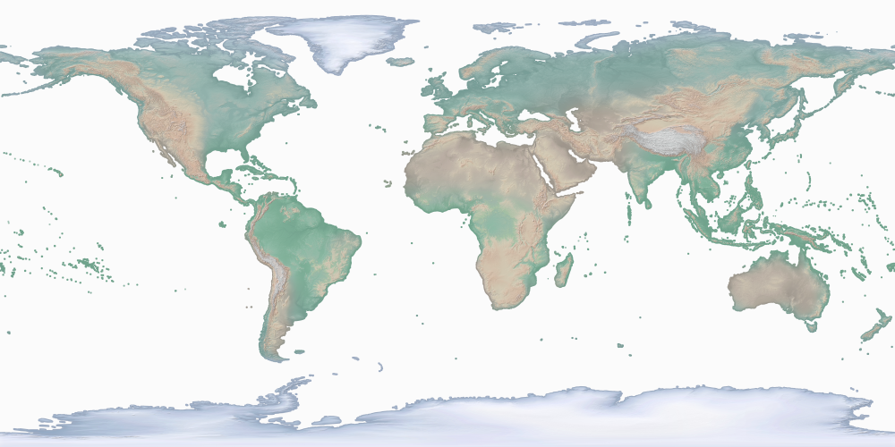
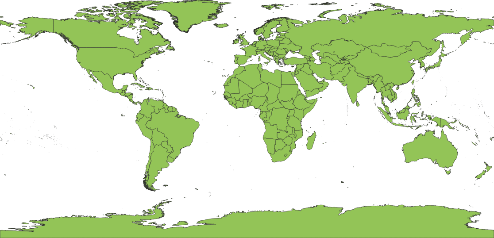
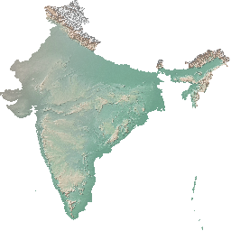
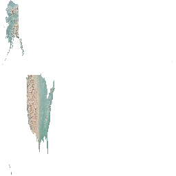
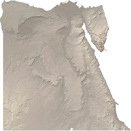
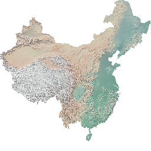

# Image Extractor with Resize
This example extends over the [image extractor](image-extractor.md) example by resizing output images to a fixed size.
While this could be simply achieved by resizing the final image after it is created, this example is more efficient
as it takes into account the output size and reduces the number of pixels early on so that the program will
scale to big data.
Another advantage of this version is that it can work with input raster that contains multiple raster files.
In this case, we cannot simply use the pixel location in the file to determine the final location of the pixel
in the output image. If the country spans multiple files, then pixel locations have to be mapped to geographical
locations to determine their relevant position.

The main idea is to model each pixel as a square. Then, we map the corners of the pixel to the geographical location.
After that, we find the relative position of that box to the minimum bounding rectangle (MBR) of the polygon.
Finally, we map that location to the final image and color all overlapping pixels with the color of that pixel.
Notice that the images below do not keep the aspect ratio of the country shape.
This is very common for machine learning which usually cares about the features and not the look of the image.
The code, however, can produce images that maintain the aspect ratio as shown below.

Below are examples of the input and output.

### Elevation map (Raster)  21,600 X 10,800 pixels


### Countries (Vector) - Total 255 countries


### Sample output files (Total 249 images)
India.png


United Sates of America.png


Egypt.png


China.png


**Note**: Some countries do not have any output images because their area is smaller than a single pixel, e.g., [Vatican](https://star.cs.ucr.edu/?NE/countries#center=41.903375,12.453876&zoom=18).

**Note**: The steps below are all described for Scala but there is a complete Java example at the end of this article.

**Note**: [A more scalable version](image-extractor-scalable.md) provides several optimizations for
scalability and robustness.

## Prerequisites
1. We will need a vector dataset that represents the world countries. [Find it on UCR-Star](https://star.cs.ucr.edu/?NE/countries#center=-21.8,-44.2&zoom=2) or download it from [NaturalEarth](https://www.naturalearthdata.com).
2. The raster dataset represents a land coloring based on elevation and can also be retrieved from [Natural Earth](https://www.naturalearthdata.com/downloads/10m-raster-data/10m-cross-blend-hypso/).

## Steps
The first step is to load both the vector and raster data as follows.

```scala
val countries: RDD[(Long, IFeature)] = sc.shapefile("NE_countries.zip")
  .zipWithUniqueId()
  .map(f => (f._2, f._1))
val elevation = sc.geoTiff("HYP_HR_SR")
```

Then, perform a raptor join operation to join them together. Notice how we expect the output as a list of integer values that represent the three color components, red, green, and blue.

```scala
val joinResults: RDD[RaptorJoinResult[Array[Int]]] =
  RaptorJoin.raptorJoinIDFull(elevation, countries, new BeastOptions())
```

Extract country MBRs and join the pixels with country MBRs to map pixels to their location in the country.
```scala
val countryMBRs: collection.Map[Long, Envelope] = countries
  .map(x => (x._1, x._2.getGeometry.getEnvelopeInternal))
  .collectAsMap()
```

Now, use the aggregateByKey method to group pixels of each country into a fixed-size array
that represent the pixel colors.

```scala
val emptyPixels: Array[Int] = new Array[Int](outputResolution * outputResolution)
val countryPixels: RDD[(Long, Array[Int])] = joinResults.map(x => (x.featureID, x))
  .aggregateByKey(emptyPixels)((pixels, result) => {
    val mbr = countryMBRs(result.featureID)
    // Map the pixel boundaries to the target image and color all target pixels with the pixel color
    // Notice that some pixels might be partially outside the polygon boundaries because the Raptor join
    // operation finds pixels with a center inside the polygon not the entire pixel inside the polygon
    var xRatio = outputResolution / mbr.getWidth
    var yRatio = outputResolution / mbr.getHeight
    if (keepAspectRatio) {
      xRatio = xRatio min yRatio
      yRatio = xRatio
    }
    val pixelLocation = new Point2D.Double()
    result.rasterMetadata.gridToModel(result.x, result.y, pixelLocation)
    val x1 = ((pixelLocation.x - mbr.getMinX) * xRatio).toInt max 0
    val y1 = (outputResolution - 1 - ((pixelLocation.y - mbr.getMinY) * yRatio)).toInt max 0
    result.rasterMetadata.gridToModel(result.x + 1.0, result.y + 1.0, pixelLocation)
    val x2 = ((pixelLocation.x - mbr.getMinX) * xRatio).toInt min (outputResolution - 1)
    val y2 = (outputResolution - 1 - ((pixelLocation.y - mbr.getMinY) * yRatio).toInt) min (outputResolution - 1)
    val color = new Color(result.m(0), result.m(1), result.m(2)).getRGB
    for (x <- x1 until x2; y <- y1 until y2) {
      val offset = y * outputResolution + x
      pixels(offset) = color
    }
    pixels
  }, (pixels1, pixels2) => {
    for (i <- pixels1.indices; if pixels1(i) == 0)
      pixels1(i) = pixels2(i)
    pixels1
  })
```

After that, build a lookup table that maps country ID to its name to use in naming output files.
```scala
val countryNames: collection.Map[Long, String] =
  countries.map(c => (c._1, c._2.getAs[String]("NAME"))).collectAsMap()
```

Finally, we put pixel colors into an image and write it to the output.
The output file name matches the name of the country.
We write all images to a directory named `output-images`
with a separate file for each country after its name. We use the Hadoop FileSystem API so that
the code will write the output to HDFS if set as the default file system.

```scala
countryPixels.foreach(cpixels => {
  val image = new BufferedImage(outputResolution, outputResolution, BufferedImage.TYPE_INT_ARGB)
  for (x <- 0 until outputResolution; y <- 0 until outputResolution) {
    val offset = y * outputResolution + x
    image.setRGB(x, y, cpixels._2(offset))
  }
  // Write the image to the output
  val imagePath = new Path("output-images", countryNames(cpixels._1)+".png")
  val filesystem = imagePath.getFileSystem(new Configuration())
  val out = filesystem.create(imagePath)
  ImageIO.write(image, "png", out)
  out.close()
})
```

## Complete code example
### Scala
```scala
import edu.ucr.cs.bdlab.beast._
import edu.ucr.cs.bdlab.beast.common.BeastOptions
import edu.ucr.cs.bdlab.beast.geolite.IFeature
import edu.ucr.cs.bdlab.raptor.{RaptorJoin, RaptorJoinResult}
import org.apache.hadoop.conf.Configuration
import org.apache.hadoop.fs.Path
import org.apache.spark.SparkConf
import org.apache.spark.rdd.RDD
import org.apache.spark.sql.SparkSession
import org.locationtech.jts.geom.Envelope

import java.awt.Color
import java.awt.geom.Point2D
import java.awt.image.BufferedImage
import javax.imageio.ImageIO

/**
 * Joins a raster image with a set of polygons and extracts a separate image for each polygon.
 * Each image is resized to a given fixed size, e.g., 256 x 256. This makes it helpful to use the extracted
 * images in machine learning algorithms which expect input images to be of the same size.
 */
object RaptorImageExtractorResize {
  def main(args: Array[String]): Unit = {
    val conf = new SparkConf().setAppName("Raptor Image Extractor with Resize")
    // Set Spark master to local if not already set
    if (!conf.contains("spark.master"))
      conf.setMaster("local")

    val outputResolution: Int = 256
    val keepAspectRatio: Boolean = true
    val spark: SparkSession = SparkSession.builder().config(conf).getOrCreate()
    val sc = spark.sparkContext
    try {
      // 1- Load the input data
      val countries: RDD[(Long, IFeature)] = sc.shapefile("NE_countries.zip")
        .zipWithUniqueId()
        .map(f => (f._2, f._1))
      val elevation: RasterRDD[Array[Int]] = sc.geoTiff("HYP_HR_SR")

      // 2- Perform a raptor join between the raster and vector data
      val joinResults: RDD[RaptorJoinResult[Array[Int]]] =
        RaptorJoin.raptorJoinIDFull(elevation, countries, new BeastOptions())

      // 3- Join the results back with country MBRs to rescale the map each pixel to its position in the pixels array
      val countryMBRs: collection.Map[Long, Envelope] = countries.map(x => (x._1, x._2.getGeometry.getEnvelopeInternal))
        .collectAsMap()
      val emptyPixels: Array[Int] = new Array[Int](outputResolution * outputResolution)
      val countryPixels: RDD[(Long, Array[Int])] = joinResults.map(x => (x.featureID, x))
        .aggregateByKey(emptyPixels)((pixels, result) => {
          val mbr = countryMBRs(result.featureID)
          // Map the pixel boundaries to the target image and color all target pixels with the pixel color
          // Notice that some pixels might be partially outside the polygon boundaries because the Raptor join
          // operation finds pixels with a center inside the polygon not the entire pixel inside the polygon
          var xRatio = outputResolution / mbr.getWidth
          var yRatio = outputResolution / mbr.getHeight
          if (keepAspectRatio) {
            xRatio = xRatio min yRatio
            yRatio = xRatio
          }
          val pixelLocation = new Point2D.Double()
          result.rasterMetadata.gridToModel(result.x, result.y, pixelLocation)
          val x1 = ((pixelLocation.x - mbr.getMinX) * xRatio).toInt max 0
          val y1 = (outputResolution - 1 - ((pixelLocation.y - mbr.getMinY) * yRatio)).toInt max 0
          result.rasterMetadata.gridToModel(result.x + 1.0, result.y + 1.0, pixelLocation)
          val x2 = ((pixelLocation.x - mbr.getMinX) * xRatio).toInt min (outputResolution - 1)
          val y2 = (outputResolution - 1 - ((pixelLocation.y - mbr.getMinY) * yRatio).toInt) min (outputResolution - 1)
          val color = new Color(result.m(0), result.m(1), result.m(2)).getRGB
          for (x <- x1 until x2; y <- y1 until y2) {
            val offset = y * outputResolution + x
            pixels(offset) = color
          }
          pixels
        }, (pixels1, pixels2) => {
          for (i <- pixels1.indices; if pixels1(i) == 0)
            pixels1(i) = pixels2(i)
          pixels1
        })

      // 4- Build a lookup table that maps country ID to its name to use in naming output files
      val countryNames: collection.Map[Long, String] =
        countries.map(c => (c._1, c._2.getAs[String]("NAME"))).collectAsMap()

      // 5- Put the pixels together into an image using the Java image API
      countryPixels.foreach(cpixels => {
        val image = new BufferedImage(outputResolution, outputResolution, BufferedImage.TYPE_INT_ARGB)
        for (x <- 0 until outputResolution; y <- 0 until outputResolution) {
          val offset = y * outputResolution + x
          image.setRGB(x, y, cpixels._2(offset))
        }
        // Write the image to the output
        val imagePath = new Path("output-images", countryNames(cpixels._1)+".png")
        val filesystem = imagePath.getFileSystem(new Configuration())
        val out = filesystem.create(imagePath)
        ImageIO.write(image, "png", out)
        out.close()
      })

    } finally {
      spark.stop()
    }
  }
}
```

### Java
```java
import edu.ucr.cs.bdlab.beast.JavaSpatialSparkContext;
import edu.ucr.cs.bdlab.beast.common.BeastOptions;
import edu.ucr.cs.bdlab.beast.geolite.IFeature;
import edu.ucr.cs.bdlab.beast.geolite.ITile;
import edu.ucr.cs.bdlab.raptor.RaptorJoin;
import edu.ucr.cs.bdlab.raptor.RaptorJoinResult;
import org.apache.hadoop.conf.Configuration;
import org.apache.hadoop.fs.FileSystem;
import org.apache.hadoop.fs.Path;
import org.apache.spark.SparkConf;
import org.apache.spark.api.java.JavaPairRDD;
import org.apache.spark.api.java.JavaRDD;
import org.apache.spark.sql.SparkSession;
import org.locationtech.jts.geom.Envelope;
import scala.Tuple2;

import javax.imageio.ImageIO;
import java.awt.*;
import java.awt.geom.Point2D;
import java.awt.image.BufferedImage;
import java.io.OutputStream;
import java.util.Map;

public class RaptorImageExtractorResizeJava {
  public static void main(String[] args) {
    // Initialize Spark
    SparkConf conf = new SparkConf().setAppName("Beast Example");

    // Set Spark master to local if not already set
    if (!conf.contains("spark.master"))
      conf.setMaster("local");

    // Create Spark session (for Dataframe API) and Spark context (for RDD API)
    SparkSession sparkSession = SparkSession.builder().config(conf).getOrCreate();
    JavaSpatialSparkContext sparkContext = new JavaSpatialSparkContext(sparkSession.sparkContext());

    final int outputResolution = 256;
    final boolean keepAspectRatio = true;

    try {
      // 1- Load the input data
      JavaPairRDD<Long, IFeature> countries = sparkContext.shapefile("NE_countries.zip")
          .zipWithUniqueId()
          .mapToPair(f -> new Tuple2<>(f._2, f._1));
      JavaRDD<ITile<int[]>> elevation = sparkContext.geoTiff("HYP_HR_SR");

      // 2- Perform a raptor join between the raster and vector data
      JavaRDD<RaptorJoinResult<int[]>> joinResults =
          RaptorJoin.raptorJoinIDFullJ(elevation, countries, new BeastOptions());

      // 3- Join the results back with country MBRs to rescale the map each pixel to its position in the pixels array
      Map<Long, Envelope> countryMBRs = countries.mapToPair(c -> new Tuple2<>(c._1, c._2.getGeometry().getEnvelopeInternal()))
          .collectAsMap();
      int[] emptyPixels = new int[outputResolution * outputResolution];
      JavaPairRDD<Long, int[]> countryPixels = joinResults.mapToPair(x -> new Tuple2<>(x.featureID(), x))
          .aggregateByKey(emptyPixels, (pixels, result) -> {
            Envelope mbr = countryMBRs.get(result.featureID());
            // Map the pixel boundaries to the target image and color all target pixels with the pixel color
            // Notice that some pixels might be partially outside the polygon boundaries because the Raptor join
            // operation finds pixels with a center inside the polygon not the entire pixel inside the polygon
            double xRatio = outputResolution / mbr.getWidth();
            double yRatio = outputResolution / mbr.getHeight();
            if (keepAspectRatio)
              xRatio = yRatio = Math.min(xRatio, yRatio);
            Point2D.Double pixelLocation = new Point2D.Double();
            result.rasterMetadata().gridToModel(result.x(), result.y(), pixelLocation);
            int x1 = Math.max(0, (int)(((pixelLocation.x - mbr.getMinX()) * xRatio)));
            int y1 = Math.max(0, (outputResolution - 1 - (int) (((pixelLocation.y - mbr.getMinY())) * yRatio)));
            result.rasterMetadata().gridToModel(result.x() + 1.0, result.y() + 1.0, pixelLocation);
            int x2 = Math.min(outputResolution - 1, (int)((pixelLocation.x - mbr.getMinX()) * xRatio));
            int y2 = Math.min(outputResolution - 1, outputResolution - 1 - (int)(((pixelLocation.y - mbr.getMinY()) * yRatio)));
            int color = new Color(result.m()[0], result.m()[1], result.m()[2]).getRGB();
            for (int x = x1; x < x2; x++) {
              for (int y = y1; y < y2; y++) {
                int offset = y * outputResolution + x;
                pixels[offset] = color;
              }
            }
            return pixels;
          }, (pixels1, pixels2) -> {
            for (int i = 0; i < pixels1.length; i++) {
              if (pixels1[i] == 0)
                pixels1[i] = pixels2[i];
            }
            return pixels1;
          });
      // 4- Build a lookup table that maps country ID to its name to use in naming output files
      Map<Long, String> countryNames =
          countries.mapToPair(c -> new Tuple2<>(c._1, c._2.getAs("NAME").toString())).collectAsMap();

      // 5- Put the pixels together into an image using the Java image API.
      countryPixels.foreach(cpixels -> {
        BufferedImage image = new BufferedImage(outputResolution, outputResolution, BufferedImage.TYPE_INT_ARGB);
        for (int x = 0; x < outputResolution; x++) {
          for (int y = 0; y < outputResolution; y++) {
            int offset = y * outputResolution + x;
            image.setRGB(x, y, cpixels._2[offset]);
          }
        }
        // Write the image to the output
        Path imagePath = new Path("output-images", countryNames.get(cpixels._1)+".png");
        FileSystem filesystem = imagePath.getFileSystem(new Configuration());
        OutputStream out = filesystem.create(imagePath);
        ImageIO.write(image, "png", out);
        out.close();
      });

    } finally {
      // Clean up Spark session
      sparkSession.stop();
    }
  }
}

```