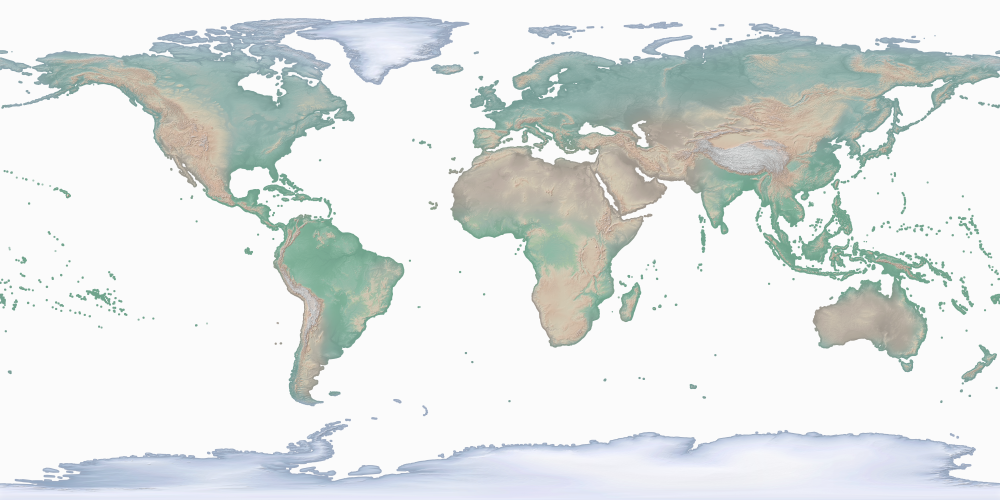

# Image Extractor
This example describes how to use the Raptor component in Beast to extract images for arbitrary polygons.
For example, given a set of polygons that represent all countries and a raster image that represents the world,
this example will produce a separate image for each country as shown below.

### Elevation map (Raster)  21,600 X 10,800 pixels


### Countries (Vector) - Total 255 countries


### Sample output files (Total 249 images)
India.png


United Sates of America.png


Egypt.png


China.png


**Note**: Some countries do not have any output images because their area is smaller than a single pixel, e.g., [Vatican](https://star.cs.ucr.edu/?NE/countries#center=41.903375,12.453876&zoom=18).

**Note**: The steps below are all described for Scala but there is a complete Java example at the end of this article.

**Note**: There are two extensions to the algorithm described here. [The first one](image-extractor-resize.md) can scale output images to a fixed size to work with machine learning.
[The second one](image-extractor-scalable.md) provides several optimizations for scalability and robustness.

## Prerequisites
1. We will need a vector dataset that represents the world countries. [Find it on UCR-Star](https://star.cs.ucr.edu/?NE/countries#center=-21.8,-44.2&zoom=2) or download it from [NaturalEarth](https://www.naturalearthdata.com).
2. The raster dataset represents a land coloring based on elevation and can also be retrieved from [Natural Earth](https://www.naturalearthdata.com/downloads/10m-raster-data/10m-cross-blend-hypso/).

## Steps
The first step is to load both the vector and raster data as follows.

```scala
val countries: RDD[(Long, IFeature)] = sc.shapefile("NE_countries.zip")
  .zipWithUniqueId()
  .map(f => (f._2, f._1))
val elevation = sc.geoTiff("HYP_HR_SR")
```

Then, perform a raptor join operation to join them together. Notice how we expect the output as a list of integer values that represent the three color components, red, green, and blue.

```scala
val joinResults: RDD[RaptorJoinResult[Array[Int]]] = RaptorJoin.raptorJoin2(elevation, countries)
```

Now, group the results by country ID to bring together all pixels.
```scala
val countryPixels: RDD[(Long, Iterable[(Int, Int, Array[Int])])] =
  joinResults.map(j => (j.featureID, (j.x, j.y, j.m))).groupByKey()
```

To prepare for output writing, we build a lookup table that maps each country ID
to its name.

```scala
val countryNames: collection.Map[Long, String] =
  countries.map(c => (c._1, c._2.getAs[String]("NAME"))).collectAsMap()
```

Finally, we group all pixels together from each country to produce an image and write it to the output.
We write all images to a directory named `output-images`
with a separate file for each country after its name. We use the Hadoop FileSystem API so that
the code will write the output to HDFS if set as the default file system.

```scala
countryPixels.foreach(x => {
  val pixels = x._2.toArray
  val minX = pixels.map(_._1).min
  val maxX = pixels.map(_._1).max
  val minY = pixels.map(_._2).min
  val maxY = pixels.map(_._2).max
  val image = new BufferedImage(maxX - minX + 1, maxY - minY + 1, BufferedImage.TYPE_INT_ARGB)
  for (pixel <- pixels) {
    val x = pixel._1 - minX
    val y = pixel._2 - minY
    image.setRGB(x, y, new Color(pixel._3(0), pixel._3(1), pixel._3(2)).getRGB)
  }
  // Write the image to the output
  val imagePath = new Path("output-images", countryNames(x._1)+".png")
  val filesystem = imagePath.getFileSystem(new Configuration())
  val out = filesystem.create(imagePath)
  ImageIO.write(image, "png", out)
  out.close()
})
```

## Complete code example
### Scala
```scala
import edu.ucr.cs.bdlab.beast.geolite.IFeature

import edu.ucr.cs.bdlab.beast._
import edu.ucr.cs.bdlab.beast.common.BeastOptions
import edu.ucr.cs.bdlab.beast.geolite.IFeature
import edu.ucr.cs.bdlab.raptor.{RaptorJoin, RaptorJoinResult}
import org.apache.hadoop.conf.Configuration
import org.apache.hadoop.fs.Path
import org.apache.spark.SparkConf
import org.apache.spark.rdd.RDD
import org.apache.spark.sql.SparkSession

import java.awt.Color
import java.awt.image.BufferedImage
import javax.imageio.ImageIO

object RaptorImageExtractor {
  def main(args: Array[String]): Unit = {
    val conf = new SparkConf().setAppName("Raptor Example")
    // Set Spark master to local if not already set
    if (!conf.contains("spark.master"))
      conf.setMaster("local")

    val spark: SparkSession = SparkSession.builder().config(conf).getOrCreate()
    val sc = spark.sparkContext
    try {
      // 1- Load the input data
      val countries: RDD[(Long, IFeature)] = sc.shapefile("NE_countries.zip")
        .zipWithUniqueId()
        .map(f => (f._2, f._1))
      val elevation = sc.geoTiff("HYP_HR")

      // 2- Perform a raptor join between the raster and vector data
      val joinResults: RDD[RaptorJoinResult[Array[Int]]] = RaptorJoin.raptorJoinIDFull(elevation, countries, new BeastOptions())

      // 3- Group the results by country ID to bring together all pixels.
      val countryPixels: RDD[(Long, Iterable[(Int, Int, Array[Int])])] =
        joinResults.map(j => (j.featureID, (j.x, j.y, j.m))).groupByKey()

      // 4- Build a lookup table that maps country ID to its name to use in naming output files
      val countryNames: collection.Map[Long, String] =
        countries.map(c => (c._1, c._2.getAs[String]("NAME"))).collectAsMap()

      // 5- Put the pixels together into an image using the Java image API.
      countryPixels.foreach(x => {
        val pixels = x._2.toArray
        val minX = pixels.map(_._1).min
        val maxX = pixels.map(_._1).max
        val minY = pixels.map(_._2).min
        val maxY = pixels.map(_._2).max
        val image = new BufferedImage(maxX - minX + 1, maxY - minY + 1, BufferedImage.TYPE_INT_ARGB)
        for (pixel <- pixels) {
          val x = pixel._1 - minX
          val y = pixel._2 - minY
          image.setRGB(x, y, new Color(pixel._3(0), pixel._3(1), pixel._3(2)).getRGB)
        }
        // Write the image to the output
        val imagePath = new Path("output-images", countryNames(x._1)+".png")
        val filesystem = imagePath.getFileSystem(new Configuration())
        val out = filesystem.create(imagePath)
        ImageIO.write(image, "png", out)
        out.close()
      })

    } finally {
      spark.stop()
    }
  }
}
```

### Java
```java
import edu.ucr.cs.bdlab.beast.JavaSpatialSparkContext;
import edu.ucr.cs.bdlab.beast.common.BeastOptions;
import edu.ucr.cs.bdlab.beast.geolite.IFeature;
import edu.ucr.cs.bdlab.beast.geolite.ITile;
import edu.ucr.cs.bdlab.raptor.RaptorJoin;
import edu.ucr.cs.bdlab.raptor.RaptorJoinResult;
import org.apache.hadoop.conf.Configuration;
import org.apache.hadoop.fs.FileSystem;
import org.apache.hadoop.fs.Path;
import org.apache.spark.SparkConf;
import org.apache.spark.api.java.JavaPairRDD;
import org.apache.spark.api.java.JavaRDD;
import org.apache.spark.sql.SparkSession;
import scala.Tuple2;
import scala.Tuple3;

import javax.imageio.ImageIO;
import java.awt.*;
import java.awt.image.BufferedImage;
import java.io.OutputStream;
import java.util.ArrayList;
import java.util.List;
import java.util.Map;

public class RaptorImageExtractorJava {
  public static void main(String[] args) {
    // Initialize Spark
    SparkConf conf = new SparkConf().setAppName("Beast Example");

    // Set Spark master to local if not already set
    if (!conf.contains("spark.master"))
      conf.setMaster("local");

    // Create Spark session (for Dataframe API) and Spark context (for RDD API)
    SparkSession sparkSession = SparkSession.builder().config(conf).getOrCreate();
    JavaSpatialSparkContext sparkContext = new JavaSpatialSparkContext(sparkSession.sparkContext());

    try {
      // 1- Load the input data
      JavaPairRDD<Long, IFeature> countries = sparkContext.shapefile("NE_countries.zip")
          .zipWithUniqueId()
          .mapToPair(f -> new Tuple2<>(f._2, f._1));
      JavaRDD<ITile> elevation = sparkContext.geoTiff("HYP_HR_SR");

      // 2- Perform a raptor join between the raster and vector data
      JavaRDD<RaptorJoinResult<int[]>> joinResults =
          RaptorJoin.raptorJoinIDFullJ(elevation, countries, new BeastOptions());

      // 3- Group the results by country ID to bring together all pixels.
      JavaPairRDD<Long, Iterable<Tuple3<Integer, Integer, int[]>>> countryPixels =
          joinResults.mapToPair(j -> new Tuple2<>(j.featureID(), new Tuple3<>(j.x(), j.y(), j.m()))).groupByKey();

      // 4- Build a lookup table that maps country ID to its name to use in naming output files
      Map<Long, String> countryNames =
          countries.mapToPair(c -> new Tuple2<>(c._1, c._2.getAs("NAME").toString())).collectAsMap();

      // 5- Put the pixels together into an image using the Java image API.
      countryPixels.foreach(value -> {
        List<Tuple3<Integer, Integer, int[]>> pixels = new ArrayList<>();
        int minX = Integer.MAX_VALUE;
        int minY = Integer.MAX_VALUE;
        int maxX = Integer.MIN_VALUE;
        int maxY = Integer.MIN_VALUE;
        for (Tuple3<Integer, Integer, int[]> pixel : value._2) {
          minX = Math.min(minX, pixel._1());
          maxX = Math.max(maxX, pixel._1());
          minY = Math.min(minY, pixel._2());
          maxY = Math.max(maxY, pixel._2());
          pixels.add(pixel);
        }

        BufferedImage image = new BufferedImage(maxX - minX + 1, maxY - minY + 1, BufferedImage.TYPE_INT_ARGB);
        for (Tuple3<Integer, Integer, int[]> pixel : pixels) {
          int x = pixel._1() - minX;
          int y = pixel._2() - minY;
          image.setRGB(x, y, new Color(pixel._3()[0], pixel._3()[1], pixel._3()[2]).getRGB());
        }
        // Write the image to the output
        Path imagePath = new Path("output-images", countryNames.get(value._1)+".png");
        FileSystem filesystem = imagePath.getFileSystem(new Configuration());
        OutputStream out = filesystem.create(imagePath);
        ImageIO.write(image, "png", out);
        out.close();
      });

    } finally {
      // Clean up Spark session
      sparkSession.stop();
    }
  }
}
```